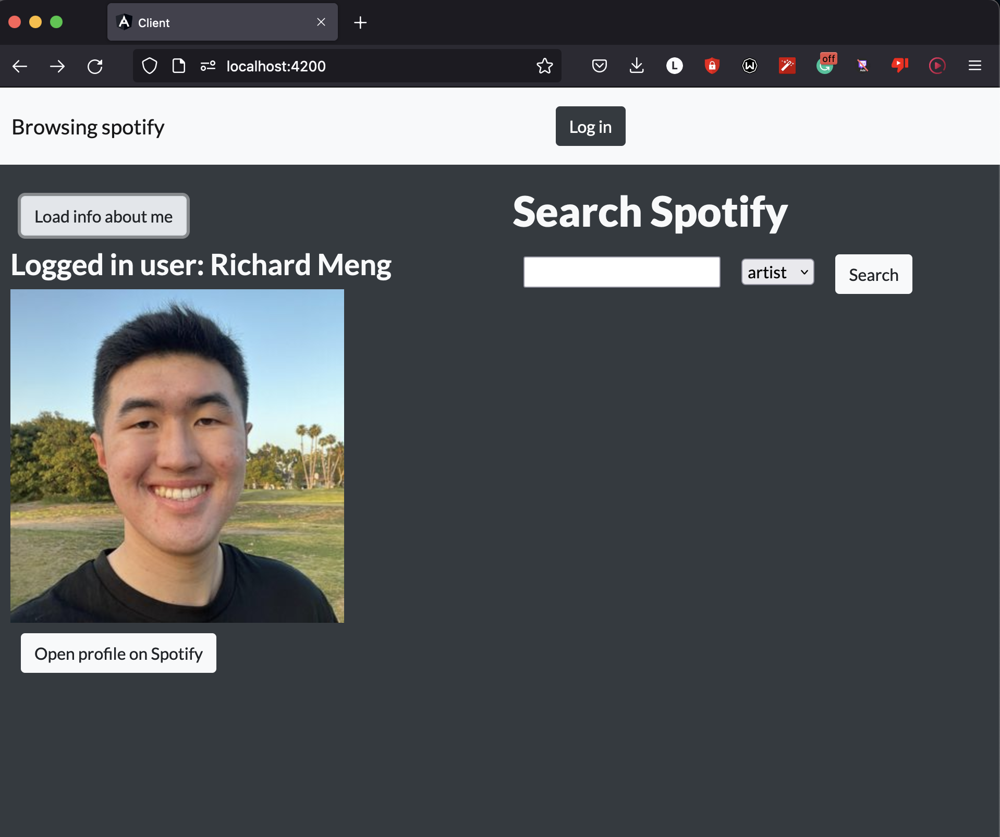

# Spotify Browser

## App features

### Home

On the inital page, you can log in to your Spotify account and load some basic info from your Spotify profile.



### Search

Once you have logged in, you can search up different Spotify artists, albums, and tracks. Here is an example:


### Artist, Album, and Track Pages

Finally, you can click on any of the search results to view that artist, album, or track in more detail. Here are some demos:


## How to Run Code

First, you are going to need the Angular CLI

```sh
npm install -g @angular/cli
```

Next, start the webserver

```sh
cd webserver
npm start
```

Finally, run the client

```sh
cd client
ng serve
```
